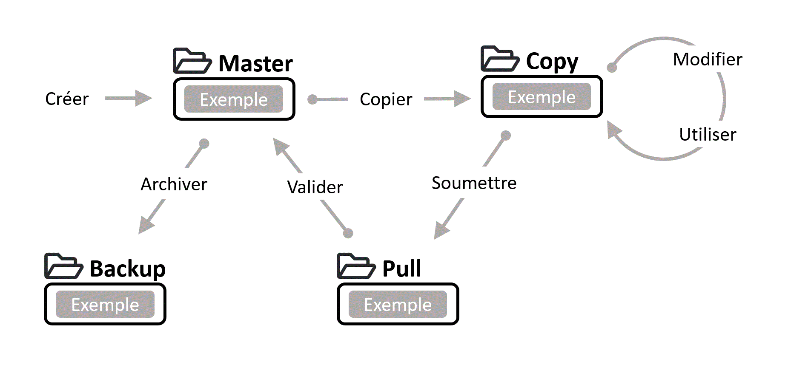
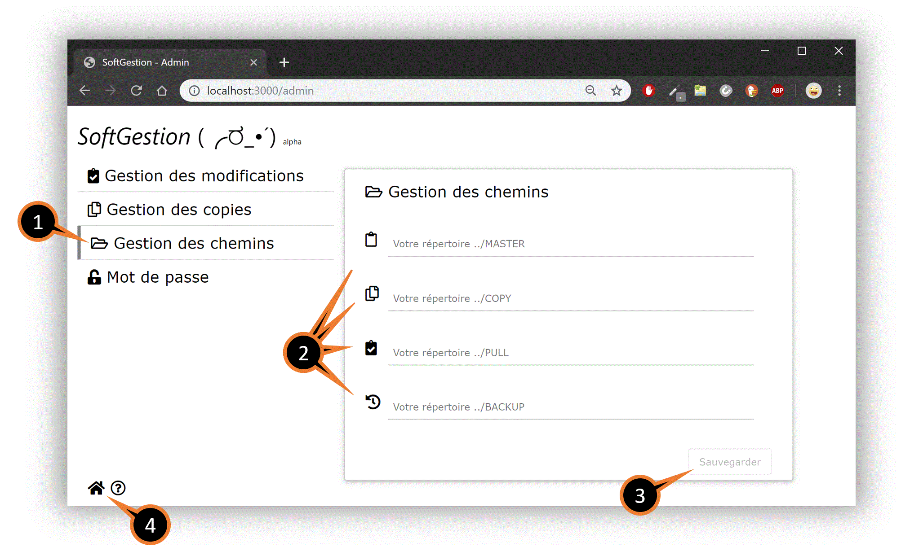
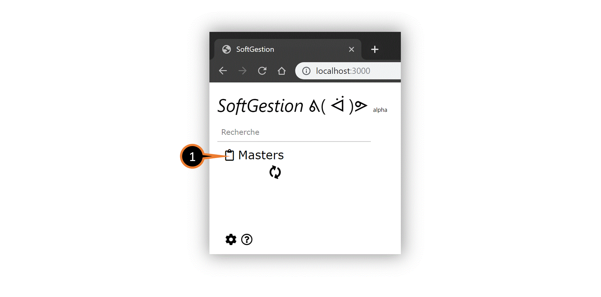
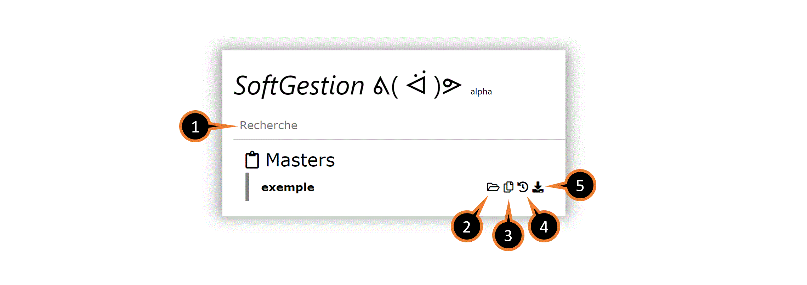
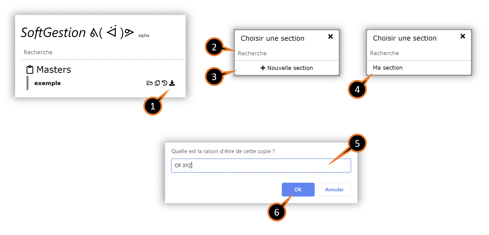
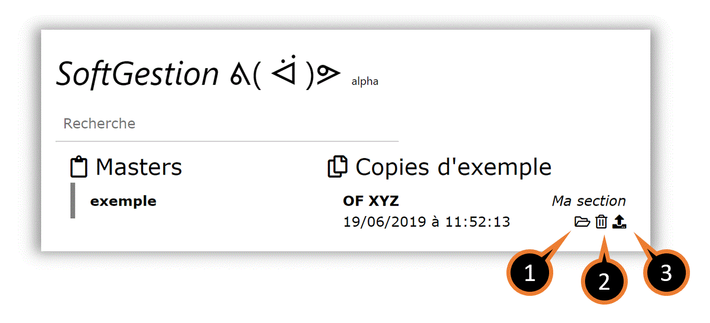
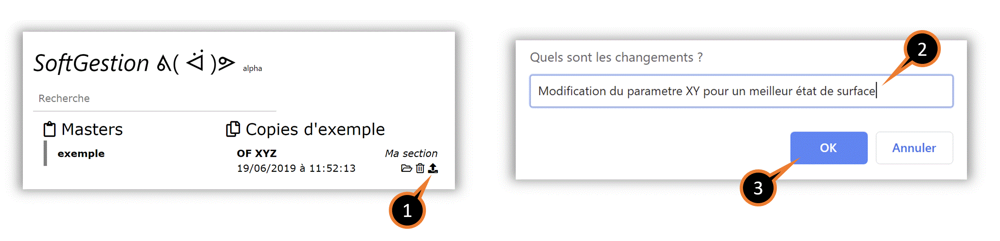
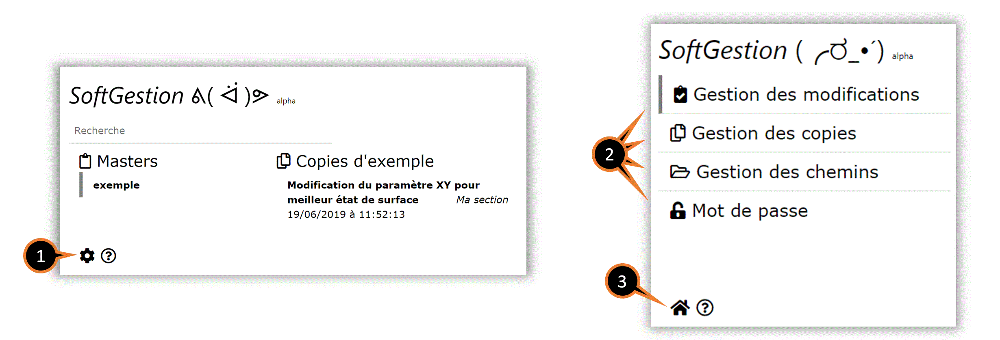
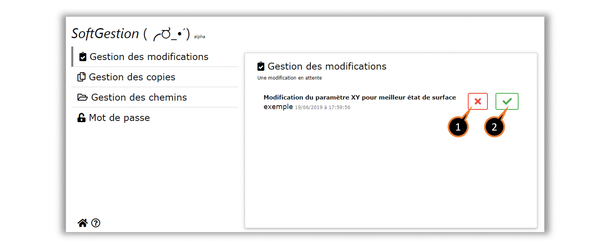
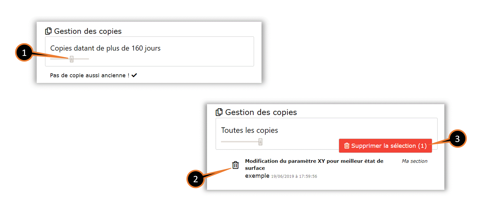

# SoftGestion
Interface facilitant la manipulation de répertoires ayant du contenu évolutif.



Elle permet de supprimer les fastidieux et dangereux copié collé manuel habituellement utilisé pour adapter des programme à ses besoins sans altérer celui d’origine. L’interface propose également une forme très primaire de gestion des versions en gérant automatiquement un fichier  de suivi et en sauvegardant le tout dans un backup.
L’application n’utilise aucune base de données. Elle reflète et manipule simplement le système de fichiers.


## Table des matières
* [Installation](#installation)
    * [Environnements d’exécution](#environnements-dexécution)
        * [Serveur](#serveur)
        * [Client](#client)
    * [Installation et démarrage](#installation-et-démarrage)
    * [Configuration du serveur](#configuration-du-serveur)
    * [Configuration du client](#configuration-du-client)
* [Utilisation vue principal](#configuration-du-serveur)
    * [Importez un dossier](#importez-un-dossier)
    * [Fonctionnalitées des masters](#fonctionnalitées-des-masters)
    * [Création d'une copie](#création-dune-copie)
    * [Fonctionnalitées des copies](#fonctionnalitées-des-copies)
    * [Proposition d'une nouvelle version](#proposition-dune-nouvelle-version)
* [Utilisation de la vue administrateur](#utilisation-de-la-vue-administrateur)
    * [Gestion des modifications](#gestion-des-modifications)
    * [Gestion des copies](#gestion-des-copies)
    * [Gestion des chemins](#gestion-des-chemins)
    * [Mot de passe](#mot-de-passe)
 * [Notes](#notes)


## Installation
### Environnements d’exécution
#### Serveur
[NodeJS](https://nodejs.org/en/)  et  NPM doit être disponibles depuis l'invite de commande.
[PM2](https://pm2.io/runtime/) sera utilisé pour gérer l’exécution.

#### Client 
L'application fonctionne sur n'importe quel navigateur moderne.
Cependant, l'interface propose des liens permettent d'accéder directement aux répertoires Windows. Ce qui n'est nativement pas possible pour le navigateur. Pour résoudre le problème, il faut installer l'extension  [Local Explorer](https://chrome.google.com/webstore/detail/local-explorer-file-manag/eokekhgpaakbkfkmjjcbffibkencdfkl) pour Google Chrome. Une autre solution, si vous souhaitez utiliser un autre navigateur, est de changer les paramètres de sécurité pour l'adresse en question.

### Installation et démarrage


```bash
# Téléchargement
$ npx degit PeufOne/softgestion softgestion
    
# Se rendre dans le sous-répertoire
$ cd softgestion

# Installation des modules
$ npm i
    
# Démarrage du serveur de production
$ npm run prod
    
# Monitoring
$ pm2 monit

# Plus de manipulation disponible dans la doc de pm2...
```

    
   
### Configuration du serveur
Le port  de production configuré par défaut est le  ***3000*** mais il peut être changé dans le fichier ***config.js***.
```js
module.exports = {
    PORT: dev ? 3001 : 3000
}
```

### Configuration du client
Tant que les chemins de vos répertoires ne seront pas configurés, vous serez automatiquement redirigé sur la page d’administration...

1. Cliquez sur l'onglet *Gestion des chemins*.
2. Renseignez les quatre champs (Attention, les chemins que vous indiquez doivent exister sur votre réseau et être accessible par le serveur).
3. Cliquez sur *Sauvegarder*.
4. Vous pouvez désormais vous rendre sur la page d’accueil.

L'application est maintenant entièrement disponible.

## Utilisation vue principal

### Importez un dossier

1. Cliquez sur le clickboard.
2. Sélectionnez le dossier que vous souhaitez importer.
3. Cliquez sur *importer*.
4. Choisisez le nom de votre nouveau dossier (il ne doit pas encore exister).
5. Validez en cliquant sur *OK*.

### Fonctionnalitées des masters

1. La bar de recherche permet de filtrer les masters
2. Ouvrir le dossier
3. Afficher les copies du master
4. Afficher les l'historiques du master
5. Créer une copie

### Création d'une copie

1. Cliquez pour ouvrir le choix des sections.
2. La bar de recherche permet de filtrer les sections.
3. Si votre recherche ne correspond à aucune sections, vous pouvez en créez une nouvelle en cliquant sur *nouvelle section*.
4. Cliquez sur la section désiré.
5. Renseignez la raison d'être de votre copie.
6. Validez en cliquant sur *OK*

### Fonctionnalitées des copies

1. Ouvrir le dossier
2. Supprimer la copie
3. Proposer une nouvelle version du dossier

### Proposition d'une nouvelle version

1. Cliquez pour proposer un nouvelle version du dossier
2. Renseignez les changements qui ont été effectué
3. Validez en cliquant sur *OK*

Une fois le proposition confirmé, il est recommandé de supprimer la copie.

## Utilisation de la vue administrateur

1. Accédez à la vue administrateur en cliquant sur la roue
2. Cliquez sur une section pour y accéder
3. Cliquez sur la maison pour revenir à la vue principal

### Gestion des modifications

1. Refuser et supprimer la modification
2. Accepter la modification (le master actuel sera archivé et remplacé)

Ces actions n'ont pas d'influence sur les copies

### Gestion des copies

1. Utilisez le curseur pour choisir l'encienneté des copies sélectionées
2. Déselectionez ou séléctionez des copies une par une en cliquant sur la poubelle
3. Cliquer sur *Supprimer la sélection*

### Gestion des chemins
Voir le chapitre *Configuration du client*

### Mot de passe
Vous avez la possibilitez de protéger l'accées à la vue admin avec un mot de passe.
Attention cependant, celui-ci est stocker en clair dans le fichier */data/password* du programme. Pour une réelle protection, le client ne doit donc pas avoir accées à ce dossier.

## Notes

Cette application n'est qu'un prototype en version alpha et de nombreuses corrections et améliorations devront encore être apporté...

Le but principal du projet est l'apprentissage et l'expérimentation de technologies modernes du web.
N’hésitez donc pas à être force de proposition concernant les fonctionnalités, l'ergonomie de l'interface ou la qualité du code.

Si vous êtes un utilisateur, surveillez les mise à jour sur [Github](https://github.com/PeufOne/softgestion)

Enjoy \\( ﾟ▽ﾟ)/